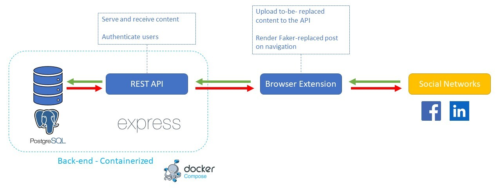

# Specifications

This document includes specifications for each components of the Faker browser extension.

## What is Faker

Faker is a browser extension that allows its users to regain control of their data by hosting their social network content on their own server.

Using Faker, social networks will receive simple links that are only accessible by users of the Faker browser extension instead of your actualcontent, preventing tracking and profiling.

This is done transparently for the user. The extension will upload text, images or videos on demand to their own server, and automatically load it when browsing the social network. Thus, the user can easily choose to delete content whenever they want as they have control of their own server.

**Note:** This is a research experiment and is not recommended for real-word usage yet.

<p align="center">
  
</p>

## Demo

[Video of Faker running on LinkedIn](./faker_demo.mp4) ([Youtube link](https://www.youtube.com/watch?v=UnMiL9gg_AY))

## How to develop Faker

[Tutorial how to develop Faker (french)](https://www.youtube.com/watch?v=r3tID4nMXtM)

## Architecture



This schema can be modified by editing the source PowerPoint file `faker_archi.pptx` and export it as a JPEG.

## What we do not keep from the previous project and why

### Previously developed Extension

The previous implementation was trying to be generic by hooking directly on `<form>` tags. This is an interesting idea that would, in theory, work with any website.

The downside is that nowadays most webapp are using Single Page Applications (SPA) and do not rely on `<form>`. They instead listen to click events then send the result using the `fetch` API.

Thus, this would not work on these type of websites. Furthermore, Faker is aimed at the big Social Networks, which are now all using SPAs, and it would not work.

We then do not keep the previous developed extension.

### Previously developed Storage self-hosted server

The server code is quite minimal. We could keep it but the team is better-versed in Node.js than Python so it is a natural choice to quickly rewrite it in TypeScript.

### Previously developed Demo Instagram Service

We settled on first focusing on LinkedIn directly. We do not keep the demo Instagram service because we want the plugin to work on a real social network to prove the concept.

We chose LinkedIn for educational/professional purposes; it is not as intrusive as facebook or another personal social network.

## Browser Extension

### Tech Stack

The extension is developed in TypeScript. Its configuration page is using [petite-vue](https://github.com/vuejs/petite-vue).

TypeScript is built using [esbuild](https://esbuild.github.io/).

### Configuration

The extension lets the user configure the URI to its [Storage self-hosted server](#storage-self-hosted-server) and its configured user/password combination.

It also let the user enable/disable the extension for each of the social networks.


### Post publish

#### Iteration 1 of the POC

In this version, a specific code is developed for each social network. An event listener with [`capture`](https://developer.mozilla.org/en-US/docs/Web/API/EventTarget/addEventListener#capture) to be executed before the original one is added to post publish buttons. Original event is blocked using [`Event.stopImmediatePropagation()`](https://developer.mozilla.org/en-US/docs/Web/API/Event/stopImmediatePropagation).

We abandoned this idea as it is not agnostic.

#### Iteration 2 of the POC

In this version, we hooked the native [`Fetch`](https://developer.mozilla.org/en-US/docs/Web/API/Fetch_API) and [`XMLHttpRequest`](https://developer.mozilla.org/en-US/docs/Web/API/XMLHttpRequest) browser APIs to execute our replace function before sending requests. Basically, we intercept the requests and replace the content with the remote content before they are sent to the social networks. It is a bit like a MITM attack.

We ditched this approach for two reasons:

1. It is a hack/workaround and is definitely not expected by the browser developers
2. It is quite agnostic, but each social network has its own way of communicating with its API, so would still require specific code
3. **[Extension]** Inject the hooking script with a `<script>` tag in the page
4. **[Page]** Hook the [`Fetch`](https://developer.mozilla.org/en-US/docs/Web/API/Fetch_API) and [`XMLHttpRequest`](https://developer.mozilla.org/en-US/docs/Web/API/XMLHttpRequest) browser APIs to execute our replace function before sending requests
5. **[Page]** When a request is being sent, if it matches a specified HTTP method and route then continue this process, else just send it as is
6. **[Page]** Ask the extension using [`window.postMessage()`](https://developer.mozilla.org/en-US/docs/Web/API/Window/postMessage) to upload the post content to the [Storage self-hosted server](#storage-self-hosted-server)
7. **[Extension]** Upload the post content to the [Storage self-hosted server](#storage-self-hosted-server) with credentials which returns its content URI
8. **[Extension]** Send the content URI to the page using [`window.postMessage()`](https://developer.mozilla.org/en-US/docs/Web/API/Window/postMessage)
9. **[Page]** Replace the post content with its content URI in the request body
10. **[Page]** Send the modified request

##### Why such a mess?

###### Different JavaScript contexts

The page and the extension are in different JavaScript contexts (i.e. `window.fetch` in the extension is not the same as `window.fetch` in the window). Thus, we inject the hooking script in the page with a `<script>` tag because we can't directly hook the functions in the page.

###### Bypass CSP

When using JavaScript in a web page, the browser will strictly follow the [Content Security Policy (CSP)](https://developer.mozilla.org/en-US/docs/Web/HTTP/CSP) sent by the remote server. Therefore, the browser prevents us from doing requests to unauthorized URIs (such as our [Storage self-hosted server](#storage-self-hosted-server)).

To work around it, we set up a message listener in the extension's context (that does not need to follow the CSP) that handles the [Storage self-hosted server](#storage-self-hosted-server) upload then we send the result back using a message from the extension (see [`window.postMessage()`](https://developer.mozilla.org/en-US/docs/Web/API/Window/postMessage)).

##### Another method we tested

1. Listen for outgoing requests
2. Look for page requests that match specified HTTP methods and routes
3. Copy the request headers and body (including cookies)
4. Abort the request
5. Send a new request from the extension with the body modified and cookies included

This works and the post is successfully created. The issue is that because the initial request was aborted, an error is show on the frontend. We could fix this by modifying the request's response but it is not permitted for browser extensions. Therefore, we trashed this.

More info:

- https://developer.chrome.com/docs/extensions/reference/webRequest/
- https://stackoverflow.com/a/37118414

#### Iteration 3 of the POC

This is the current version of the browser extension. It is (hopefully?) agnostic to every websites. We use a contextual menu.

##### Text Posts

1. User write its post as usual on the website
2. User selects the text they want to replace, then clicks on the `Replace text using Faker` contextual menu
3. A `Faker is uploading your file...` loading overlay is shown on the page
4. Ask the extension using [`window.postMessage()`](https://developer.mozilla.org/en-US/docs/Web/API/Window/postMessage) to upload the post content to the [Storage self-hosted server](#storage-self-hosted-server)
5. **[Background]** Upload the post content to the [Storage self-hosted server](#storage-self-hosted-server) with credentials which returns its content URI
6. **[Background]** Send the content URI to the page using [`window.postMessage()`](https://developer.mozilla.org/en-US/docs/Web/API/Window/postMessage)
7. Replace the post content with its content URI in the input box
8. User publish the post as usual

##### Medias

1. User clicks on the `Upload a file using Faker` contextual menu
2. A `Faker is listening for file uploads` overlay is shown on the page
3. Faker look for any `input[type="file"]` on the page and add an event listener to them with [`capture`](https://developer.mozilla.org/en-US/docs/Web/API/EventTarget/addEventListener#capture) to be executed before the original one. Original event is blocked using [`Event.stopImmediatePropagation()`](https://developer.mozilla.org/en-US/docs/Web/API/Event/stopImmediatePropagation)
4. The user uploads a file as they usually would
5. A `Faker is uploading your file...` loading overlay is shown on the page
6. Ask the extension using [`window.postMessage()`](https://developer.mozilla.org/en-US/docs/Web/API/Window/postMessage) to upload the media to the [Storage self-hosted server](#storage-self-hosted-server)
7. **[Background]** Upload the media to the [Storage self-hosted server](#storage-self-hosted-server) with credentials which returns its content URI
8. **[Background]** Send the content URI to the page using [`window.postMessage()`](https://developer.mozilla.org/en-US/docs/Web/API/Window/postMessage)
9. Render the media URI as a QR code image in canvas
10. If a video: render the QR code as the video using [`MediaRecorder`](https://developer.mozilla.org/en-US/docs/Web/API/MediaRecorder), add a random dots animation to make the video file bigger (LinkedIn requires video to be 75 KB minimum)
11. The QR code is injected in the targetted `input[type="file"]`, the social network never receives the original file
12. User publish the post as usual


**Note:** We implemented this as a toggle to turn on/off the file input listening from the extension so we do not mistakenly replace a file when not needed (e.g. the user changes its profile picture).

### Post render

We did not find a way to make this agnostic, so everything is social network specific.

1. Periodically check the page content for posts containing a link including `/faker/api`
2. Fetch the content using the uri included in the post
3. Replace the post with the retrieved content
4. Show on the post that is was pulled from a Faker server

There may be a better and more agnostic way to do this, hint: [`MutationObserver`](https://developer.mozilla.org/en-US/docs/Web/API/MutationObserver).

Plus, this will break as soon as social networks updates their frontend.

Posts rendering:

- LinkedIn
  - [x] Post
  - [x] Image
  - [x] Video
- Facebook
  - [x] Post
  - [ ] Image
  - [ ] Video
- Twitter
  - [x] Post
  - [ ] Image
  - [ ] Video
- Instagram
  - [ ] Image
  - [ ] Video
- Reddit
  - [ ] Post
  - [ ] Image
  - [ ] Video

## Storage self-hosted server

The server stores the content the user posts on a social network (posts and comments), and returns a link to retrieve it.

### Tech Stack

Typescript, Node.js, PostgreSQL, [Sequelize ORM](https://sequelize.org/), [Express.js](https://expressjs.com/), Docker.

### Database Schema

| posts               |
| ------------------- |
| `id`: `UUID`        |
| `content`: `TEXT`   |
| `createdAt`: `DATE` |
| `updatedAt`: `DATE` |

| medias              |
| ------------------- |
| `id`: `UUID`        |
| `content`: `BLOB`   |
| `createdAt`: `DATE` |
| `updatedAt`: `DATE` |

| api_users             |
| --------------------- |
| `id`: `INTEGER`       |
| `username`: `VARCHAR` |
| `password`: `VARCHAR` |
| `createdAt`: `DATE`   |
| `updatedAt`: `DATE`   |

### Authentication

Write operations (`POST`, `DELETE`) require the user to be authenticated using Basic auth (base64 of `username:password`).

The credentials must be set as environment variable (`API_USER`, `API_PASSWORD`) on the server first start to initialize the user in the database.

### API

#### `GET /faker/api/posts/:id`

Load the textual post associated with the provided `id`.

#### `GET /faker/api/media/:id`

Load the media file associated with the provided `id`.

#### `POST /faker/api/upload`

The API can distinguish if the uploaded content is a textual post or a media file by looking at the incoming `Content-Type` header.

##### Textual Post

###### Request Headers

| Name            | Value                                 |
| --------------- | ------------------------------------- |
| `Content-Type`  | `application/json`                    |
| `Authorization` | `Basic <base64 of username:password>` |

###### Request Body

```json
{
  "content": "My textual post content"
}
```

##### Media

**Note:** For now, the only supported file formats are:

- `image/jpeg` -`.jpeg`
- `image/png` - `.png`
- `image/webp` -`.webp`
- `video/mp4` - `.mp4`

###### Request Headers

| Name            | Value                                 |
| --------------- | ------------------------------------- |
| `Content-Type`  | `multipart/form-data`                 |
| `Authorization` | `Basic <base64 of username:password>` |

###### Request Body

| Key     | Value        |
| ------- | ------------ |
| `media` | File content |

## Additional notes

### Brave Shields

If you are using Brave, Brave Shields is blocking the requests to fetch the content from the Faker server as it looks like a third-party request. Looks like a browser bug. Disable it.

### Twitter video upload

Twitter video upload does not work `Source media is of invalid format 3. Only MP4 and MpegTs are supported`, uploaded video are webm but are not supported by the website.

### Facebook removes posts from timeline

Facebook does weird things where replaced posts would randomly disappear, they probably compare visible posts with their local cache and see something is wrong and delete the DOM node

### Usability of the projet

A big issue with this project is that non technical users will not host their own server. If there are no users to begin with, it will be hard to onboard new users. There need to be an easy way to user Faker. Below are potential suggestions.

#### Public instance

Propose a public instance of the server where users connect to by default, accepting that doing this is worse for data privacy than self-hosting your own server.

#### Peer-to-peer file sharing

Upload the content using a P2P protocol like [IPFS](https://ipfs.io/) or [WebTorrent](https://webtorrent.io/). Think about a way to retain the content as it will disappear from the network if no one is hosting it (see [IPFS Persistence, permanence, and pinning](https://docs.ipfs.io/concepts/persistence/#persistence-versus-permanence)).

If opting for this, add End-to-End Encryption as content on P2P networks are visible by peers.

#### Missing features

- Add a list of uploaded content in the extension options with delete buttons to remove the content
- Make the content only loadable when coming from the same domain (domain is currently passed by the extension using the head `X-Faker-Domain` but not stored nor checked when fetching the data)
